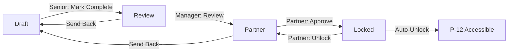

# P-11: GROUP AUDIT PLANNING - QUICK START

## 🎯 WHAT IS P-11?

P-11: Group Audit Planning is the **eleventh mandatory tab** in the Statutory Audit Planning Phase (qaco_planning_phase module), implementing **ISA 600 (Revised)** - Special Considerations—Audits of Group Financial Statements.

---

## 📦 FILES DELIVERED

| File | Purpose | Lines |
|------|---------|-------|
| `planning_p11_group_audit_complete.py` | 4 models (main + 3 child models) | 1,100+ |
| `planning_p11_views_complete.xml` | Complete UI (12 notebook tabs) | 800+ |
| `p11_access_rules.csv` | Security rules (3 user groups × 4 models) | 18 |
| `planning_p11_reports.xml` | 3 PDF reports | 400+ |
| `P11_IMPLEMENTATION_GUIDE.md` | Full implementation documentation | - |
| `P11_README.md` | This quick-start guide | - |

---

## ⚡ QUICK INSTALLATION

### **1. Copy Files**
Place files in their respective directories:
```
qaco_planning_phase/
├── models/planning_p11_group_audit_complete.py
├── views/planning_p11_views_complete.xml
├── security/p11_access_rules.csv
├── reports/planning_p11_reports.xml
└── P11_IMPLEMENTATION_GUIDE.md
```

### **2. Update `models/__init__.py`**
```python
from . import planning_p11_group_audit_complete
```

### **3. Update `__manifest__.py`**
```python
'data': [
    'security/p11_access_rules.csv',
    'views/planning_p11_views_complete.xml',
    'reports/planning_p11_reports.xml',
],
```

### **4. Upgrade Module**
```bash
odoo-bin -u qaco_planning_phase -d your_database
```

---

## 🔐 PRE-CONDITIONS

P-11 **requires** these phases to be completed first:

| Phase | State Required | Reason |
|-------|---------------|--------|
| **P-10** | Locked (partner-approved) | Related parties must be identified before group audit planning |
| **P-6** | Partner/Locked | Risk assessment must be finalized |
| **P-2** | Partner/Locked | Entity and group structure must be understood |

**System enforces this automatically.** You cannot create P-11 if pre-conditions are not met.

---

## 📋 SECTIONS OVERVIEW

| Section | Name | Key Features |
|---------|------|--------------|
| **A** | Determination of Applicability | Is this a group audit? Basis of consolidation |
| **B** | Component Identification | Register all components with financial data |
| **C** | Component Risk Assessment | Link to P-6 risks, assess component-level risks |
| **D** | Component Auditor Evaluation | Independence, competence, regulatory environment |
| **E** | Scope of Work | Determine audit scope per component |
| **F** | Group-Wide Risks & Responses | Link to P-6/P-7, plan group-level responses |
| **G** | Communication | Instructions to component auditors (ISA 600.40) |
| **H** | Supervision & Quality | ISQM-1 / ISA 220 considerations |
| **I** | Consolidation Process | Understanding consolidation procedures |
| **J** | Mandatory Attachments | Group structure, instructions, confirmations |
| **K** | Conclusion | Professional judgment, final confirmations |
| **L** | Review & Approval | Manager review → Partner approval → Lock |

---

## 🔄 WORKFLOW



---

## 🚨 CRITICAL VALIDATIONS

### **1. Escalation Flags**
- If any component auditor has `independence_confirmed = False` or `competence_adequate = False`
- System sets `escalation_flag = True`
- **Partner cannot approve** until escalation resolved

### **2. Mandatory Fields**
System blocks progression if missing:
- **Section A:** Basis for conclusion (or N/A rationale)
- **Section B:** At least one component (if group audit)
- **Section C:** Component risk narrative
- **Section E:** Scope determination basis
- **Section F:** Planned group responses
- **Section G:** Instructions documented
- **Section H:** Quality management considerations
- **Section I:** Consolidation review confirmed
- **Section J:** Group structure attachment
- **Section K:** All final confirmations checked

### **3. Auto-Computed Fields**
- **Component Significance:** Auto-computed from `% Assets` / `% Revenue` vs. threshold (default 10%)
- **Escalation Flag:** Auto-computed from component auditor confirmations
- **Component Counts:** Auto-computed from component register

---

## 📊 KEY MODELS

### **1. `audit.planning.p11.group_audit` (Main Model)**
- Core P-11 record
- Contains all sections A-L
- State management (draft → review → partner → locked)
- Pre-condition enforcement
- Audit trail logging

### **2. `audit.planning.p11.component` (Child)**
- Component register
- Financial significance auto-computation
- Risk profile
- Scope determination
- Link to component auditor

### **3. `audit.planning.p11.component_risk` (Child)**
- Risk assessment per component
- Link to P-6 risks (`p6_risk_id`)
- Planned audit responses
- Response responsibility (group team vs. component team)

### **4. `audit.planning.p11.component_auditor` (Child)**
- Component auditor evaluation
- Independence confirmation (ISA 600.20)
- Competence assessment (ISA 600.21-23)
- Regulatory environment (ISA 600.24-26)
- Escalation flag

---

## 📄 PDF REPORTS

Access from P-11 record → Print:

1. **Group Audit Planning Memorandum**
   - Complete ISA 600 documentation
   - All sections A-K
   - Sign-off section

2. **Component Risk Summary**
   - Risk matrix
   - Detailed risk assessments

3. **Component Scope Matrix**
   - Scope determination per component
   - Materiality and deadlines

---

## 🔗 INTEGRATION FLOW

```
P-10 (Locked) ──> P-11 (Accessible)
                    │
                    ├─> Links to P-6 (Risks)
                    ├─> Links to P-7 (Fraud)
                    ├─> Links to P-2 (Entity)
                    │
P-11 (Locked) ──> P-12 (Unlocked)
```

---

## 🧪 TESTING SCENARIOS

### **Scenario 1: Pre-Condition Block**
1. Try to create P-11 without P-10 locked
2. **Expected:** UserError with message listing missing pre-conditions

### **Scenario 2: Component Significance**
1. Add component with 15% of group assets
2. **Expected:** `is_significant` auto-checked

### **Scenario 3: Escalation Flag**
1. Add component auditor with `independence_confirmed = False`
2. **Expected:** `escalation_flag = True`, partner approval blocked

### **Scenario 4: Mandatory Fields**
1. Try to mark complete without filling Section A basis
2. **Expected:** UserError listing missing requirements

### **Scenario 5: Partner Approval Flow**
1. Senior marks complete → state = review
2. Manager reviews → state = partner
3. Partner approves → state = locked
4. **Expected:** P-12 accessible, audit trail logged

---

## 🛠️ TROUBLESHOOTING

### **Issue:** Cannot create P-11
**Solution:** Check P-10 is locked, P-6 and P-2 are partner/locked

### **Issue:** Cannot approve P-11
**Solution:** Check for escalation flags on component auditors

### **Issue:** Component significance not auto-computing
**Solution:** Ensure `percentage_group_assets` and `percentage_group_revenue` are filled

### **Issue:** PDF reports not generating
**Solution:** Check `reports/planning_p11_reports.xml` is loaded in manifest

### **Issue:** Security access denied
**Solution:** Verify `p11_access_rules.csv` is loaded and user is in correct group

---

## 📞 ISA REFERENCES

| Standard | Coverage |
|----------|----------|
| **ISA 600 (Revised)** | Paras 16-44 (entire group audit framework) |
| **ISA 315** | Component-level risk identification |
| **ISA 330** | Audit responses to component risks |
| **ISA 220** | Quality management |
| **ISQM-1** | Firm-level quality management in group context |
| **ISA 240** | Fraud risks at group level |
| **ISA 570** | Going concern in group structure |
| **ISA 230** | Audit documentation and trail |

---

## ✅ COMPLIANCE CHECKLIST

- [x] ISA 600 (Revised) - Full compliance
- [x] Component identification (ISA 600.27-31)
- [x] Component auditor evaluation (ISA 600.19-26)
- [x] Communication requirements (ISA 600.40)
- [x] Supervision framework (ISA 600.42-44)
- [x] Quality management (ISQM-1 / ISA 220)
- [x] Audit trail (ISA 230)
- [x] Pakistan Companies Act 2017
- [x] ICAP QCR / AOB inspection ready
- [x] Court-defensible documentation

---

## 📈 QUICK METRICS

After P-11 implementation, your system will have:

- **4 new models** for group audit planning
- **12 notebook tabs** covering ISA 600 requirements
- **3 PDF reports** for audit file documentation
- **18 security rules** (3 groups × 4 models × read/write/create)
- **1,100+ lines** of Python business logic
- **800+ lines** of XML views
- **Full audit trail** per ISA 230

---

## 🎓 TRAINING NOTES

### **For Audit Staff:**
- Complete sections A-K before marking complete
- Upload mandatory documents in Section J
- Check all component details are accurate

### **For Managers:**
- Review all sections thoroughly
- Verify component risk assessments
- Document review findings in review notes

### **For Partners:**
- Review escalation flags (Section D)
- Provide substantive comments (mandatory per ISA 220)
- Confirm group audit strategy is sound before approval

---

## 🚀 GO-LIVE CHECKLIST

- [ ] Files copied to correct directories
- [ ] `__init__.py` updated
- [ ] Manifest updated
- [ ] Module upgraded successfully
- [ ] Test P-11 creation (should check pre-conditions)
- [ ] Test component addition and significance calculation
- [ ] Test escalation flag logic
- [ ] Test manager review workflow
- [ ] Test partner approval and lock
- [ ] Verify P-12 unlocking
- [ ] Generate all 3 PDF reports
- [ ] Verify audit trail logging
- [ ] User permissions tested (trainee/manager/partner)

---

## 📧 SUPPORT

For issues or questions:
1. Review `P11_IMPLEMENTATION_GUIDE.md` for detailed implementation
2. Check ISA 600 (Revised) for standard requirements
3. Verify pre-conditions are met (P-10/P-6/P-2)
4. Test in development environment before production

---

**Last Updated:** 2025-12-19  
**Module Version:** 17.0.2.0  
**ISA Compliance:** ISA 600 (Revised 2021)  

---

## 🎉 YOU'RE READY!

P-11 is now fully implemented and ready for group audit planning in accordance with ISA 600 (Revised). The system enforces all mandatory requirements, provides comprehensive documentation, and maintains a court-defensible audit trail.

**Next Step:** Complete P-10 → Create P-11 → Plan group audit → Approve → Unlock P-12

---

**END OF QUICK START GUIDE**
